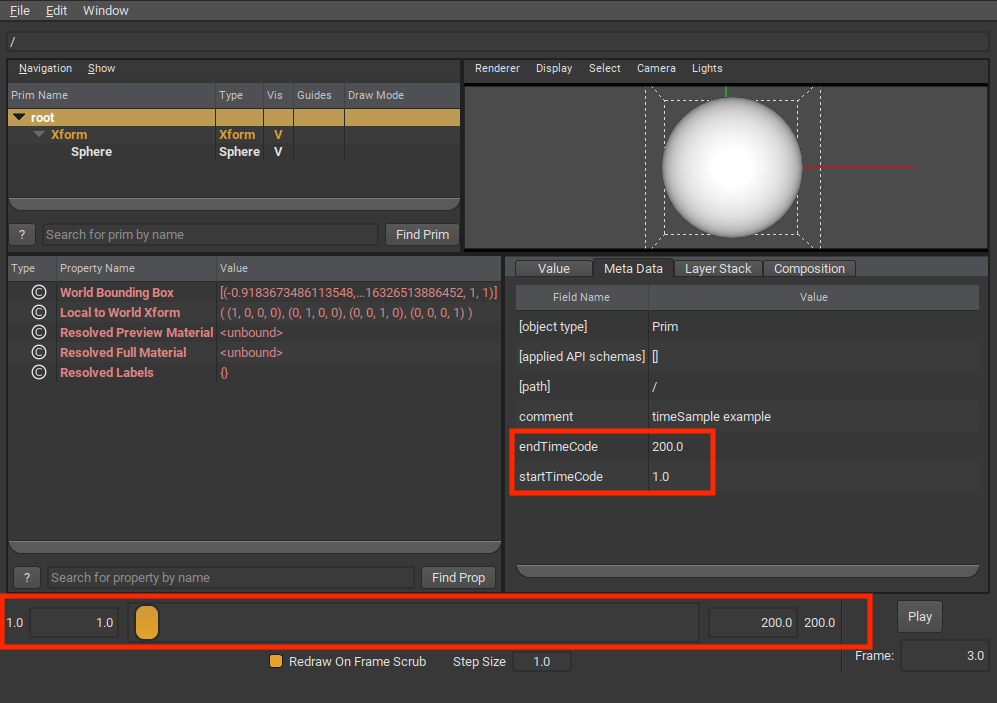
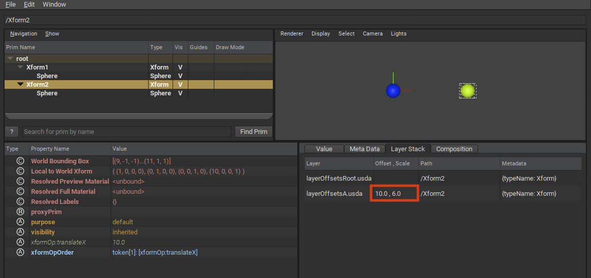

.. include:: ../rolesAndUtils.rst

.. _time_and_animated_values:

########################
Time and Animated Values
########################

OpenUSD supports authoring animated values that do not resolve to a single 
static value but vary in value over time. This functionality is typically used 
for describing animations in a USD scene, but can be used for any scenario where 
time-varying values are needed, such as simulations. 

To support animated values, OpenUSD provides features to author animated values, 
query and interpolate values over time, and work with "clips" of animated data.

.. contents:: Table of Contents
    :local:
    :depth: 3

.. _time_understanding_timecodes:

***********************
Understanding TimeCodes
***********************

TimeCodes are the basic time coordinate for USD. By themselves, TimeCodes are 
unitless, and do not necessarily conceptually map to "frames per second". 
TimeCodes also do not represent other industry standard time codes, such as 
SMPTE. Keeping TimeCodes unitless gives clients flexibility to encode their 
time-varying data in ways that make the most sense for their application, while 
at the same time OpenUSD still provides mechanisms for mapping TimeCodes to real 
time units for decoding and playback, as described in 
:ref:`time_scaling_timecodes_to_real_time` below.

TimeCodes are encoded in USD layers as numeric (double precision) values. The 
following simple example shows animated attribute values (using 
:ref:`TimeSamples <usdglossary-timesample>`) represented as pairs of TimeCodes 
and values (in this case, float values specifying a translation along the
X-axis).

.. code-block:: usda

   double xformOp:translateX.timeSamples = {
        1: 0,
        25: 10,
        99: 5,
    }

TimeCodes are most commonly used as the time coordinate for animated values,
as shown above. However, you can also specify that an attribute or metadata
field's value type is a TimeCode.

.. code-block:: usda

    def "PrimA"
    (
        # custom metadata with timecode value type 
        customData = {
            timecode timeCodeMetadata = 24
        }
    )
    {
        # attribute with timecode value type 
        timecode timeCodeAttr = 24
    }

When used this way, the attribute or metadata field's value will be subject to
any TimeCode scaling or offsets via composition, as described in 
:ref:`time_working_with_timecode_offsets`.

.. admonition:: Avoid Using Infinite TimeCodes

    When working with TimeCodes, you may encounter situations where you 
    want to use "infinite" time coordinates. For example, you might have an 
    animated attribute where you want to set an arbitrary "earliest" value at 
    time "negative infinity", so you can adjust the TimeCode later. 

    While OpenUSD allows authoring and querying using infinite (-inf/inf) 
    TimeCodes, we strongly discourage working with infinite TimeCodes. 
    TimeCodeRanges created with infinite TimeCodes are not considered valid, 
    DCC tools may not be able to represent infinite TimeCodes, and the use
    of infinite TimeCodes may create future incompatibilities.    

.. _time_working_with_timecodes_programmatically:

Working With TimeCodes Programmatically
=======================================

OpenUSD provides ways for working with TimeCodes programmatically, for cases
where you want to query an animated attribute at a particular TimeCode, or
over a TimeCode range. The following example Python code demonstrates using 
TimeCode APIs to query and author animated values. Note that while you can use 
double-precision values when querying an animated attribute, we recommend using 
TimeCodes to ensure future compatibility.

.. code-block:: python

    # Given an attribute with animated values, get the value
    # at a specific timeCode (which could be interpolated)
    workTimeCode = Usd.TimeCode(14)
    workValue = translate_attr.Get(workTimeCode)

    # Set a new value at a specific timeCode (for this example we assume
    # the attribute is using time samples for animated values)
    newTimeCode = Usd.TimeCode(24)
    translate_attr.Set(2, newTimeCode)

When working with TimeCodes programmatically, there are 
some situations where the exact numeric value for a TimeCode is not known, or 
can't be represented. OpenUSD provides the following features for these 
situations.

* For cases where you are looking for the "earliest" time in a set of TimeCodes, 
  OpenUSD provides 
  :usdcpp:`UsdTimeCode.EarliestTime() <UsdTimeCode::EarliestTime()>`. 
  For example, if you had the following animated values for the 
  :usda:`xformOp:translateX` attribute:

  .. code-block:: usda

     double xformOp:translateX.timeSamples = {
         3: 5,
         25: 10,
         99: 5,
     }

  The following Python query would get the attribute value at the earliest 
  TimeCode for :usda:`xformOp:translateX` (for this example, the value of
  5 at the earliest TimeCode, which is 3).

  .. code-block:: python

     earliestValue = translate_attr.Get(Usd.TimeCode.EarliestTime())

* For cases where you want the value immediately before a given TimeCode, 
  OpenUSD provides 
  :usdcpp:`UsdTimeCode.PreTime(time) <UsdTimeCode::PreTime(double)>`. 
  This is useful in situations where an attribute's value can change 
  discontinuously at a specific TimeCode, for example, when evaluating 
  attributes with "held" interpolation values, or splines with dual-valued 
  knots at the given TimeCode. 
  :usdcpp:`UsdTimeCode.PreTime(time) <UsdTimeCode::PreTime(double)>` will
  evaluate the limit of an attribute's animated value as time 
  approaches the given time from the "left". For example, using the same set
  of animated values for the :usda:`xformOp:translateX` attribute that we used
  previously:

  .. code-block:: usda

     double xformOp:translateX.timeSamples = {
         3: 5,
         25: 10,
         99: 5,
     }

  The following Python query would get the attribute value for the 
  :usda:`xformOp:translateX` attribute just prior to TimeCode 25 (which in 
  this example would be evaluated to 10.0, as the interpolated value is 
  continuous at TimeCode 25).

  .. code-block:: python

     preValue = translate_attr.Get(Usd.TimeCode.PreTime(25))

* OpenUSD has a special "Default" sentinel TimeCode coordinate. The 
  :usdcpp:`Default <UsdTimeCode::Default()>` TimeCode is used when working with 
  attributes that have :ref:`default values <usdglossary-defaultvalue>` 
  --- "static", non-time-varying values separate from animated values (if any) 
  for an attribute. In inequality comparisons, the Default TimeCode is 
  considered less than any numeric TimeCode, include :mono:`EarliestTime()`. 
  The following Python example queries the :usda:`xformOp:translateX` attribute 
  for its default value, if any.

  .. code-block:: python

     defaultValue = translate_attr.Get(Usd.TimeCode.Default())

.. _time_scaling_timecodes_to_real_time:

Mapping TimeCodes to Real Time
==============================

TimeCode coordinates for animated values are mapped to real-time seconds by 
scaling by the layer's :usda:`timeCodesPerSecond` metadata. The following 
example sets :usda:`timeCodesPerSecond` to 24.

.. code-block:: usda

    #usda 1.0
    (
        timeCodesPerSecond = 24
    )

Assuming the scene used a TimeCode range that started at 0, this would mean a 
TimeCode of 240 would correspond to 10 seconds of real time.

OpenUSD also provides the legacy :usda:`framesPerSecond` layer metadata, used
as an indication of the desired playback rate when the animation is viewed in a 
playback device (DCC tool, :program:`usdview`, etc.). 

.. admonition:: Legacy Behavior of :mono:`framesPerSecond`

    :usda:`framesPerSecond` normally does not affect TimeCode scaling and does 
    not combine or interfere with any :usda:`timeCodesPerSecond` value. However, 
    OpenUSD does provide a special legacy behavior where the
    :usda:`framesPerSecond` value, if set, is used as a fallback value for 
    :usda:`timeCodesPerSecond` if :usda:`timeCodesPerSecond` is *not* set. The 
    order of precedence OpenUSD uses for determining the 
    :usda:`timeCodesPerSecond` to use is:

    1. :usda:`timeCodesPerSecond` from session layer
    2. :usda:`timeCodesPerSecond` from root layer
    3. :usda:`framesPerSecond` from session layer
    4. :usda:`framesPerSecond` from root layer
    5. fallback value of 24     

    The general best practice is to use :usda:`timeCodesPerSecond` to specify 
    how TimeCodes are scaled to real time, and :usda:`framesPerSecond` if you 
    need to encode a specific playback rate on playback devices, regardless of 
    how many samples per second are recorded in the USD scene. We provide the 
    information about :usda:`framesPerSecond` as fallback for 
    :usda:`timeCodesPerSecond` primarily as a debugging aid, should you observe 
    unexpected time-scaling. The fallback behavior derives only from USD's 
    relationship to Pixar's Presto animation system.

.. _time_layer_start_end_times:

Specifying Layer Start and End Times
====================================

You can specify start and end time codes in a layer using the 
:usda:`startTimeCode` and :usda:`endTimeCode` layer metadata.

.. code-block:: usda

    #usda 1.0
    (
        startTimeCode = 1
        endTimeCode = 240
    )

This TimeCode range is primarily used by clients when determining the initial 
playback range to expose to users in a tool. For example, :program:`usdview` 
uses this range to set the initial range in the playback bar.

:usda:`startTimeCode` and :usda:`endTimeCode` are not used by OpenUSD to set an 
actual value resolution evaluation range. For example, if you had authored 
animated values outside the startTimeCode/endTimeCode range, you can still query 
for those values, or for interpolated values outside the 
startTimeCode/endTimeCode range.

.. _time_using_timecode_ranges:

Using TimeCode Ranges
=====================

If you need to programmatically create a closed range of TimeCodes, use 
:usdcpp:`UsdUtilsTimeCodeRange`. Note that you cannot use TimeCode's 
:usdcpp:`EarliestTime <UsdTimeCode::EarliestTime()>` or 
:usdcpp:`Default <UsdTimeCode::Default()>` as the start 
or end TimeCode for the range. You can specify a non-zero stride used for 
iterating over TimeCodes in the range. The following Python snippet creates a 
TimeCodeRange using the stage's start and end TimeCode, with a stride of 2 
TimeCodes, to iterate and get an attribute value over that range.

.. code-block:: python

    timeCodeRange = UsdUtils.TimeCodeRange(stage.GetStartTimeCode(), 
                                           stage.GetEndTimeCode(), 2)
    for timeCode in timeCodeRange:
        print(f"At TimeCode {timeCode}, attribute value is: "
              f"{example_attribute.Get(timeCode)}")

Negative stride values are allowed only if the range's start TimeCode is greater 
than or equal to the range's end TimeCode.              

.. _time_working_with_timecode_offsets:

Working with Automatic and Explicit TimeCode Remapping Across Composition
=========================================================================

When a layer uses composition via 
:ref:`sublayering <usdglossary-sublayers>`, 
:ref:`references <usdglossary-references>`, or 
:ref:`payloads <usdglossary-payload>`, OpenUSD can apply a scale and/or offset 
to the TimeCode coordinates for animated values and the values of any 
TimeCode-valued attributes and metadata from the target layer. This provides the 
flexibility to use animated data in your workflow in different scenes with 
different time frames of reference.

.. _time_automatic_scaling:

Automatic Scaling of timeCodesPerSecond
---------------------------------------

If a layer specifies :usda:`timeCodesPerSecond` and is targeted by a sublayer,
reference, or payload composition arc, the TimeCode values and 
animated value coordinates in the targeted layer are automatically scaled to map 
into the time frame defined by the source layer's :usda:`timeCodesPerSecond`.

The following example :filename:`animationA.usda` layer specifies a 
:usda:`timeCodesPerSecond` of 12.

.. code-block:: usda
    :caption: animationA.usda

    #usda 1.0
    (
        timeCodesPerSecond = 12
    )

This layer is sublayered into another layer :filename:`animationRoot.usda` that 
specifies a :usda:`timeCodesPerSecond` of 24.

.. code-block:: usda
    :caption: animationRoot.usda

    #usda 1.0
    (
        timeCodesPerSecond = 24
        subLayers = [
          @animationA.usda@  
        ] 
    )

With :filename:`animationRoot.usda` as the root layer in a composed stage, any 
TimeCodes for animated attribute values on prims from 
:filename:`animationA.usda` would be automatically scaled to 
:filename:`animationRoot.usda`'s time frame. In this case, the 
TimeCodes would be scaled by a factor of 2, so that an animated value at 
TimeCode 12 in :filename:`animationA.usda` (which would map to 1 second in 
:filename:`animationA.usda`'s :usda:`timeCodesPerSecond`) would have its 
TimeCode scaled to 24 to match the desired 1 second time mapping in 
:filename:`animationRoot.usda`'s time scaling. The following diagram shows a 
couple of TimeCodes in :filename:`animationA.usda` scaled to map to 
the :filename:`animationRoot.usda` :usda:`timeCodesPerSecond` mapping.

.. image:: time_automaticscale.drawio.svg
    :width: 50%
    :alt: Automatic scaling of TimeCodes

This automatic scaling is applied across the entire 
:ref:`LayerStack <usdglossary-layerstack>` targeted by the 
sublayer/reference/payload composition arc. For example, 
:filename:`animationA.usda` could also sublayer another layer, 
:filename:`animationB.usda` (not shown) that has its own 
:usda:`timeCodesPerSecond` of 6.

.. code-block:: usda
    :caption: animationA.usda with sublayer

    #usda 1.0
    (
        timeCodesPerSecond = 12
        subLayers = [
          @animationB.usda@  # animationB has timeCodesPerSecond = 6  
        ] 
    )

In the composed stage, the TimeCodes for animated values in 
:filename:`animationB.usda` would be automatically scaled by 2 to fit within 
:filename:`animationA.usda`'s time frame, and then automatically scaled 
again by 2 to fit within :filename:`animationRoot.usda`'s time frame.

The automatic scaling is also applied to authored values of attributes or
metadata fields of the TimeCode value type. For example, suppose 
:filename:`animationA.usda` had a prim with an attribute and metadata field of 
TimeCode value type.

.. code-block:: usda
    :caption: animationA.usda with TimeCode value type attribute and metadata

    #usda 1.0
    (
        timeCodesPerSecond = 12
    )

    def "PrimA"
    (
        # metadata with timecode value type
        customData = {
            timecode timeCodeMetadata = 10
        }
    )
    {
        # attribute with timecode value type 
        timecode timeCodeAttr = 15 
    }    

If this layer were sublayered into :filename:`animationRoot.usda` with a 
:usda:`timeCodesPerSecond` of 24, the metadata field and attribute values would 
be automatically scaled in the flattened results.

.. code-block:: usda
    :caption: animationRoot.usda flattened with scaled timecode values

    #usda 1.0
    (
        timeCodesPerSecond = 24
    )

    def "PrimA" (
        customData = {
            timecode timeCodeMetadata = 20
        }
    )
    {
        timecode timeCodeAttr = 30
    }

Note there is no automatic application of a layer's :usda:`startTimeCode` or 
:usda:`endTimeCode` as offsets for TimeCode coordinates in a composed stage. 
There is a way to manually specify an offset, discussed in the next section.

.. _time_configuring_using_layer_offsets:

Configuring TimeCode Scaling and Offsets Using LayerOffsets
-----------------------------------------------------------

If you need to scale or shift the TimeCodes in a 
:ref:`sublayer <usdglossary-sublayers>` or 
:ref:`referenced <usdglossary-references>` or 
:ref:`payloaded <usdglossary-payload>` layer, you can do so by adding a 
"LayerOffset" to the composition arc. For example, you might have character 
animation that you want to re-use for a different background character, but it 
needs to be re-timed for the current scene.

The following :filename:`layerOffsetsRoot.usda` layer specifies a LayerOffset 
with an offset of 10 and a scale of 2 for a sublayer composition.

.. code-block:: usda
    :caption: layerOffsetsRoot.usda

    #usda 1.0
    (
        timeCodesPerSecond = 24
        subLayers = [
          @layerOffsetsA.usda@ (offset = 10; scale = 2)
        ]
    )

In the composed stage, TimeCodes for animated values in 
:filename:`layerOffsetsA.usda` will be scaled and offset accordingly. Note that 
when mapping from a layer's time frame to that of the layer that references or 
sublayers it, OpenUSD will apply **scaling first, and then the offset**, if both 
are specified. 

.. math::

    \text{Adjusted TimeCode} = (\text{Layer TimeCode} * \text{LayerOffset scale}) + \text{LayerOffset offset}

In the above example, an animated value at TimeCode 10 in 
:filename:`layerOffsetsA.usda` will have its TimeCode scaled to 20, and then 
offset by 10 to 30, in the composed stage. The following diagram shows TimeCodes 
from :filename:`layerOffsetsA.usda` being scaled by 2 and then offset by 10 in a 
composed stage.

.. image:: time_layeroffset.drawio.svg
    :width: 50%
    :alt: Layer Offset with scale and offset

LayerOffsets can be specified for references and payloads in a similar way. The 
following example applies a scale and offset to the TimeCodes for any animated 
attributes of a referenced Prim.

.. code-block:: usda

    def Xform "Xform2"
    (
        prepend references = @animationA.usda@</Xform2> (offset = 10; scale = 2)
    )
    {
    }

As mentioned in :ref:`time_understanding_timecodes`, TimeCodes can be used as
an attribute or metadata field's value type. LayerOffsets will scale and offset
authored TimeCode values just like TimeCode coordinates. For example, assume you
had the following :filename:`timeCodeValues.usda` layer. 

.. code-block:: usda
    :caption: timeCodeValues.usda

    def "PrimA"
    (
        # custom metadata with timecode value type 
        customData = {
            timecode timeCodeMetadata = 10
        }
    )
    {
        # attribute with timecode value type 
        timecode timeCodeAttr = 15
    }

This layer is then sublayered into :filename:`timeCodeValuesRoot.usda`
with a LayerOffset scale and offset.

.. code-block:: usda
    :caption: timeCodeValuesRoot.usda

    #usda 1.0
    (
        startTimeCode = 1
        endTimeCode = 240
        timeCodesPerSecond = 24
        subLayers = [
          @timeCodeValues.usda@ (offset = 10; scale = 2)
        ]
    )

If :filename:`timeCodeValuesRoot.usda` is loaded into a stage and flattened,
the result will have the LayerOffset applied to the TimeCode attribute and 
metadata field values from PrimA.

.. code-block:: usda
    :caption: flattened timeCodeValuesRoot.usda

    def "PrimA" (
        customData = {
            timecode timeCodeMetadata = 30
        }
    )
    {
        timecode timeCodeAttr = 40
    }

Keep in mind the following requirements for LayerOffsets.

* Scale cannot be 0. This will cause a composition error and the LayerOffset 
  will be ignored.
* Scale also cannot be negative (this will also cause a composition error and
  be ignored), as this could cause incorrect resolution of animated values. 
  If you want to reverse the time order of TimeCodes, consider using the 
  :ref:`Value Clips <usdglossary-valueclips>` feature.
* Offset can be negative, which results in the TimeCodes being offset "earlier" 
  in the composed stage. 
* A LayerOffset itself cannot be animated. You can't change the specified 
  offset or scale over time. If you need this behavior, the 
  :ref:`Value Clips <usdglossary-valueclips>` feature can provide this.

In :program:`usdview`, you can see the LayerOffset for a given layer stack via 
the "Layer Stack" tab.

.. _time_combining_automatic_scaling_and_offsets:

Combining Automatic Scaling and Layer Offsets
---------------------------------------------

If you apply a LayerOffset to a target layer, and the target layer has a 
:usda:`timeCodesPerSecond` that differs from that of the referencing layer, 
OpenUSD applies both the automatic source/target layer scaling and the 
LayerOffset scale (in that order) to TimeCodes in the composed stage. For 
example, assume you have the following :filename:`animationLayer.usda` layer.

.. code-block:: usda
    :caption: animationLayer.usda

    #usda 1.0
    (
        timeCodesPerSecond = 8
    )

If you then sublayered this layer in the root layer of your stage, using a 
Layer Offset with a scale of 2:

.. code-block:: usda
    :caption: animationRootLayer.usda

    #usda 1.0
    (
        timeCodesPerSecond = 24
        subLayers = [
          @animationLayer.usda@ (offset = 10; scale = 2)
        ]
    )

TimeCodes for animated values in :filename:`animationLayer.usda` would be 
adjusted as follows. First, the automatic scaling would adjust TimeCodes by a 
factor of 3 (from the animationRootLayer's :usda:`timeCodesPerSecond` value of
24 divided by animationLayer's :usda:`timeCodesPerSecond` value of 8). Then, the 
adjusted TimeCodes would be adjusted further by a factor of 2 (from the subLayer 
LayerOffset scale) and offset by 10. For example, a TimeCode coordinate of 10 in 
:filename:`animationLayer.usda` would be multiplied by 3, then multiplied by 2,
and finally offset by 10, resulting in a TimeCode coordinate of 70 in the 
composed stage.